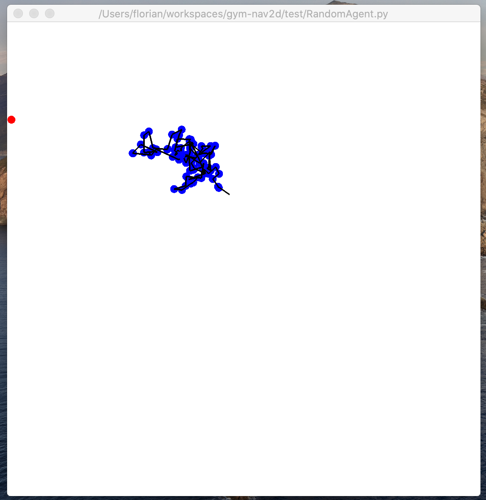
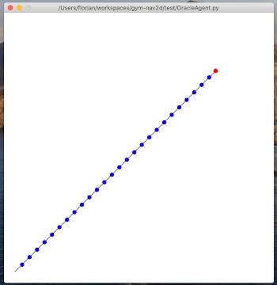

# gym-nav2d
A simple continuous action 2d navigation task.

## How to use

1. Clone this repository and navigate into this folder
2. Activate your python environment and run `pip install -e .` to build a package and link it locally to folder.
3. Import gym, see test/RandomAgent for a basic usage.

## Overview
### Details
* Names: 
    * gym_nav2d:nav2dVeryEasy-v0
    * gym_nav2d:nav2dEasy-v0
    * gym_nav2d:nav2dHard-v0
    * gym_nav2d:nav2dVeryHard-v0
* Category: Classic Control

### Description
Find a point goal in a simple 2D navigation maze.

## Source
Florian Soulier

## Observation
The observation depends on the gym you load. _gym_nav2d:nav2dVeryEasy-v0_, _gym_nav2d:nav2dEasy-v0_, _gym_nav2d:nav2dHard-v0_ have the following observation:

Type: Box(5)

| Num  | Observation                     | Min  | Max    |
| ---- | ------------------------------- | ---- | ------ |
| 0    | agent position x                | 0    | 255    |
| 1    | agent position y                | 0    | 255    |
| 2    | goal position x                 | 0    | 255    |
| 3    | goal position y                 | 0    | 255    |
| 4    | distance between agent and goal | 0    | 360,63 |

4 is calculated by: $$\sqrt{(255-0)^2+(255-0)^2}$$

For _gym_nav2d:nav2dVeryHard-v0_ only 4 is given. 

## Actions

Type: Box(2)

| Num  | Action    | Min  | Max  |
| ---- | --------- | ---- | ---- |
| 0    | degree    | 0    | 2pi  |
| 1    | step_size | 0    | 10   |

**Hint**: We expect floats between -1 and 1 (e.g. output of tanh), in form of [float, float] and convert those to an angle in rad and a steps size between 0 and 10.

## Reward

step reward is calculated by following formula:

$$R_t = - d/10 - 1$$

the step reward is actual distance and -1 per timestep.

the cumulated reward is:

$$R = \sum \dfrac{-d}{10}-1$$

If the agent reaches the goal, it gets a bonus rewad of 1000. 

## Starting state

The starting state depends on the environment. Here is an overview:

| Name     | start    | goal     | observation |
| -------- | -------- | -------- | ----------- |
| VeryEasy | fixed    | fixed    | 0..4        |
| Easy     | variable | fixed    | 0..4        |
| Hard     | variable | variable | 0..4        |
| VeryHard | variable | variable | only 4      |

## Episode Termination

The episode ends when you  reach eps-position (see *gym_nav2d:nav2dVeryEasy-v0* init method ) or if 100 iterations are reached.

## Solved Requirements

Well, in the VeryEasy env an agents needs max $$ceil(\sqrt{(200-10)^2+(200-10)^2}:10) = 27$$ steps. You can poof this with the OracleAgent in test folder. This env is no big challenge and meant to be a test env, wether your RL agent can learn anything.

The Easy case is meant to be a common RL problem, where you always have the same goal but your agent starts at different positions.

The Hard env is a lot harder, since the goal will be variable too and will take a lot more training time as the Easy env. This can be used to compare with meta learners.

In the Easy, Hard and VeryHard env, a very good agents needs max $$ceil(\sqrt{(255-0)^2+(255-0)^2}:10) = 37 $$ steps in the worst case. Since they distinct in start, goal positions and observations, you can assume more steps also as solved, especially Hard and VeryHard.

## Agents

Two sample agents are implemented. RandomAgents shows a completely untrained agent and OracleAgent mimics an agent, that has learned a strong policy.

## Open bugs

Something seems to be odd with the OracleAgent (does have problems with atan2(x,y) when x or y near 0). Unsure if it will be fixed in future, since it has no influence to the gym env.